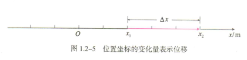
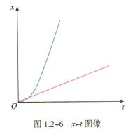
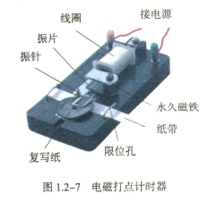
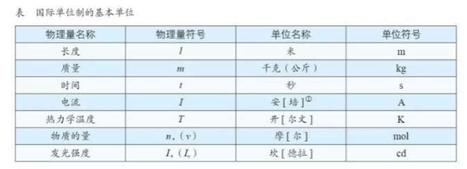
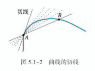
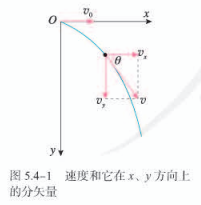
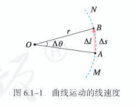
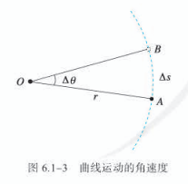
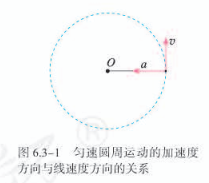

# 
高中物理学习笔记

##### 物理学：研究物质及其运动规律的科学 ——《序言》

---
[toc]

## 第一册

### 第一章 运动的描述

物体的空间位置随时间的变化，是自然界中最简单、最基本的运动形态，叫作**机械运动**。

#### 1. 质点 参考系

1. 在某些情况下，可以忽略物体的大小和开关，把它简化为一个具有质量的点，这样的点叫作**质点**。
2. 要描述一个物体的运动，首先要选定某个其他物体作为参考，观察物体的位置相对于这个“其他物体”是否随时间变化，以及怎样变化。这种用来作为参考的物体叫作**参考系**。

#### 2. 时间 位移

1. **时刻**与**时间**：时刻是一个时间点，如8点上课，8点45分下课，这是指这节课开始和结束的时刻，而这两个时刻之间的45分钟就是时间间隔。

2. **位移**：

- 直线运动的位移

$$\Delta x = x_2 - x_1$$

- 位移——时间图像

- 位移和时间的测量

#### 3. 位置变化快慢的描述——速度

1. 物理学中用位移与发生这段位移所用的时间之比表示物体运动的快慢，这就是**速度**（velocity）。

> 速度通常用字母 $v$ 表示，如果在时间 $\Delta t$ 内物体的位移是 $\Delta x$ ，它的速度就可以表示为 $$ v = \frac{\Delta x}{\Delta t} $$

在国际单位制中，速度的单位是**米每秒**，符号是$m/s$或$m\cdot s^{-1}$ 。

*速率是矢量，它既有大小，又有方向。速度的方向（物理运动的方向）和位移的方向相同。*

2. 平均速度和瞬时速度：

- 一般来说，物体在某一段时间内，运动的快慢通常是变化的。所以，由$\frac{\Delta x}{\Delta t}$ 求得的速度 $ v $ ，表示的只是物体在时间 $\Delta t$ 内运动的平均快慢程度，叫作**平均速度（average velocity）**。

- 当$\Delta t$ 足够小时，运动快慢的差异可以忽略不计，此时就把$\frac{\Delta x}{\Delta t}$叫作物体在$t$ 时刻的**瞬时速度(instantaneous velocity)**。

- 瞬时速度的大小通常叫作**速率（speed）**。

#### 4. 速度变化快慢的描述——加速度

1. 物理学中把速度的变化量与发生这一变化所用的时间之比，叫作**加速度（acceleration）**。通常用$a$表示。若用$\Delta v$表示速度在时间$\Delta t$内的变化量，则有$$a=\frac{\Delta v}{\Delta t}$$

在国际单位制中，加速度的单位是**米每二次方秒**，符号是$m/s^2$ 或$m\cdot s^{-2}$。

*加速度是矢量，它既有大小，也有方向。*

*加速度方向与速度变化量的方向相同。*

---

### 第二章 匀变速直线运动的研究

#### 1. 实验：探究小车速度随时间变化的规律
#### 2. 匀变速直线运动的速度与时间的关系
#### 3. 匀变速直线运动的位移与时间的关系
#### 4. 自由落体运动

1. 在同一地点，一切物体自由下落的加速度都相同，这个加速度叫作**自由落体加速度**，也叫**重力加速度**，通常用 $g$ 表示。重力加速度的方向是竖直向下。

---

### 第三章 相互作用——力

#### 1. 重力与弹力

1. 由于地球的吸引而使物体受到的力叫作**重力（gravity）**。

物体受到的重力 $G$ 与物体质量的关系是 $$G=mg$$

其中 $g$ 是自由落体的加速度（重力加速度）。

2. **弹力**

**胡克定律**：$F = kx$， $k$ 叫作弹簧的**劲度系数**。

#### 2. 摩擦力

1. 两个相互接触的物体，当它们相对滑动时，在接触面上会产生一种阻碍相对运动的力，这种力叫作**滑动摩擦力**。

**滑动摩擦力的大小跟压力的大小成正比**。$$F_f=\mu F_压$$

$\mu$ 是比例常数，叫作**动摩擦因数**。

2. 相互接触的两个物体之间只有相对运动的趋势，而没有相对运动，所以这时的摩擦力叫作**静摩擦力**。

#### 3. 牛顿第三定律

1. **两个物体之间的作用力和反作用力总是大小相等，方向相反，作用在同一条直线上。**

#### 4. 力的合成和分解

1. 实验表明，在两个力合成时，以表示这两个力的有向线段为邻边作平行四边形，这两个邻边之间的对角线就代表合力的大小和方向。这个规律叫**平行四边形定则**。

2. 既有大小又有方向，相加时遵守平行四边形定则的物理量叫作**矢量(vector)**。只有大小，没有方向，相加时遵守算术法则的物理量叫作**标量（scalar）**。

#### 5. 共点力的平衡

1. **在共点力作用下物体平衡的条件是合力为0**。
---

### 第四章 运动和力的关系

#### 1. 牛顿第一定律

1. **一切物体总保持匀速直线运动状态或静止状态，除非作用在它上面的力迫使它改变这种状态。**
物体这种保持原来匀速直线运动状态或静止状态的性质叫作**惯性**。牛顿第一定律也被叫作惯性定律。

物体维持其原有运动状态的“能力”不同，质量越大的物体惯性越大。描述物体惯性的物理量是它的**质量**。

*质量只有大小，没有方向，是标量。* 
在国际单位制中，质量的单位是千克，符号是$kg$。

#### 2. 实验：探究加速度与力、质量的关系
#### 3. 牛顿第二定律

1. **物体加速度的大小跟它受到的作用力成正比，跟它的质量成反比，加速度的方向跟作用力的方向相同。**

牛顿第二定律可表述为 $$a \varpropto \frac{F}{m}$$
也可以写成等式 $$F=kma$$
$k$ 是比例系数，当 $k=1$ 时，质量为 $1kg$ 的物体在某力的作用下获得 $1m/s^{2}$ 的加速度，则这个力 $$F = ma = 1kg \cdot m/s^{2}$$
力的单位是**千克米每二次方秒**。后人为了纪念牛顿，把它称作“牛顿”，用符号 $N$ 表示。在质量的单位取千克，加速度的单位取米每二次方秒，力的单位取牛顿时，牛顿第二定律可以表述为 $$F = ma$$

#### 4. 力学单位制

1. 在物理学中，只要选定几个物理量的单位，就能够利用物理量之间的关系推导出其他物理量的单位。这些被选定的物理量叫作**基本量**，它们相应的单位叫作**基本单位**。由基本量根据物理关系推导出来的其他物理量叫作**导出量**，推导出来的相应的单位叫作**导出单位**。

#### 5. 牛顿运动定律的应用
#### 6. 超重和失重

**课题研究**

**学生实验**

1. 任何测量结果都不可能绝对准确。测量值跟被测物理量的真实值之间总会有些差异，这种差异叫作**误差（error）**。

2. 由偶然因素造成的误差叫作**偶然误差**。由仪器结构缺陷，实验方法不完善造成的误差，叫作**系统误差**。

3. 物理学中把测量值与真实值之差，叫作**绝对误差**。物理学中把绝对误差与测量值之比，叫作**相对误差**。

4. 带有一位不可靠数字的近似数叫作**有效数字**。
---

## 第二册

### 第五章 抛体运动

#### 1. 曲线运动

1. 当 $B$ 点非常非常接近 $A$ 点时，这条割线就叫作曲线在 $A$ 点的**切线**。**质点在曲线上某一点的速度方向，沿曲线在这一点的切线方向。**

2. **当物体所受合力的方向与它的速度方向不在同一直线上时，物体做曲线运动。**

#### 2. 运动的合成与分解

遵守矢量运算法则，参考力的合成与分解。

#### 3. 实验：探究平抛运动的特点

1. 以一定的速度将物体抛出，在空气阻力可以忽略的情况下，物体只受重力的作用，这时的运动叫作**抛体运动**。如果初速度是沿水平方向的，这样的抛体运动叫作**平抛运动**。

#### 4. 抛体运动的规律

1. $x$ 方向，忽略空气阻力，速度不变 $v_x = v_0$。
2. $y$ 方向，只受重力， $v_y = gt$
---

### 第六章 圆周运动

#### 1. 圆周运动

1. 圆周运动中，弧长 $\Delta s$ 与时间 $\Delta t$ 之比反应了物体在 $A$ 点附近时运动的快慢，如果 $\Delta t$ 非常非常小，$\frac{\Delta s}{\Delta t}$ 就可以表示物体在 $A$ 点时运动的快慢，通常把它称为**线速度**。用符号 $v$ 表示，则有 $$v = \frac{\Delta s}{\Delta t}$$ 。

2. 如果物体沿着圆周运动，并且线速度的大小处处相等，这种运动叫作**匀速圆周运动**。

3. $$\omega = \frac{\Delta \theta}{\Delta t}$$

角的单位是**弧度**，符号是**rad**，所以角速度的单位是**弧度每秒**，符号是**rad/s**，通常把“弧度”或“rad”略去不写，所以角速度的单位可以写为 $s^{-1}$ 。

4. 做匀速圆周运动的物体，运动一周所用的时间叫作**周期**，用 $T$ 表示。周期也是常用的物理量，它的单位与时间的单位相同。转速是指物体转动的圈数与所用的时间之比，常用符号 $n$ 表示，转速的单位为**转每秒（r/s）**，或**转每分（r/min）**。 $r/s$ 和 $r/min$ 都不是国际单位制中的单位，运算时往往要把它们换算成弧度每秒。

5. 线速度与角速度的关系： $v=\omega r$ 。**在圆周运动中，线速度的大小等于角速度的大小与半径的乘积。**

#### 2. 向心力

做匀速圆周运动的物体所受的合力总指向圆心。这个指向圆心的力就叫做**向心力**。

1. 向心力的大小可以表示为 $$F_n=m\omega ^2 r$$ 或者 $$F_n=m\frac{v^2}{r}$$

#### 3. 向心加速度

1. 物体做匀速圆周运动时的加速度总指向圆心，我们把它叫作**向心加速度**。

2. 向心加速度的大小 $$a_n=\frac{v^2}{r}$$ 或 $$a_n=\omega ^2 r$$

#### 4. 生活中的圆周运动
---

### 第七章 万有引力与宇宙航行

#### 1. 行星的运动

**开普勒第一定律**：所有行星绕太阳运动的轨道都是椭圆，太阳处在椭圆的一个焦点上。

开普勒第一定律告诉我们：
1. 行星绕太阳运行的轨道严格来说不是圆而是椭圆；
2. 太阳不是在椭圆的中心，而是在其中的一个焦点上；
3. 行星与太阳间的距离是不断变化的。

**开普勒第二定律**：对任意一个行星来说，它与太阳的连线在相等的时间内扫过的面积相等。

开普勒第二定律告诉我们：
1. 当行星离太阳较近的时候，运行的速度较大，而离太阳较远的时候速度较小。

**开普勒第三定律**：所有行星轨道的半长轴的三次方根跟它的公转周期的二次方的比都相等。

若用 $a$ 代表椭圆轨道的半长轴， $T$ 代表公转周期，开普勒第三定律告诉我们： $$\frac{a^3}{T^2} = k$$

比值 $k$ 是一个对所有行星都相同的常量。

#### 2. 万有引力定律

1. **万有引力定律**：自然界中任何两个物体都相互吸引，引力的方向在它们的连线上，引力的大小与物体的质量 $m_1$ 和 $m_2$ 的乘积成正比、与它们的距离 $r$ 成反比，即 $$F=G\frac{m_1m_2}{r^2}$$

式中 $G$ 是比例系数，叫作**引力常量**，适用于任何两个物体。

2. 卡文迪许实验结果推算出万有引力常量。国际科技数据委员会2014年的推荐值 $G=6.67408(31) \times 10^{-11} N\cdot m^2 / kg ^2$ ，通常取 $G=6.67 \times 10^{-11} N\cdot m^2 / kg ^2$ 

#### 3. 万有引力理论的成就

1. 通过万有引力计算地球质量：由重力由引力产生得 $$mg=G\frac{mm_地}{R^2}$$

即 $$m_地=\frac{gR^2}{G}$$ 

$R$ 为地球半径。

2. 计算天体质量：行星做匀速圆周运动的向心力由万有引力提供。

$$G\frac{mm_太}{r^2} = m\omega ^2 r$$ ，由 $\omega = \frac{2\pi}{T}$ 得

$$G\frac{mm_太}{r^2}=m\frac{4\pi ^2 r}{T^2}$$ 得

$$m_太=\frac{4\pi ^2 r^3}{GT^2}$$

因此测出行星公转周期 $T$ 和它与太阳的距离 $r$ ，就可以算出太阳的质量。

同理要计算某个行星的质量，只要知道该行星的一个颗卫星绕其公转的周期与此卫星到此行星的距离即可。

#### 4. 宇宙航行

1. 根据万有引力提供物体运动所需的向心力，可得 $$G\frac{mm_地}{r^2}=m\frac{v^2}{r}$$

有 $v = \sqrt \frac{Gm_地}{r}$ 。已知地球半径，计算可得 $v=7.9km/s$ ，此即为**第一宇宙速度**。

物体在地面附近绕地球做匀速圆周运动时，可以近似认为向心力是由重力提供，有

$$mg = m\frac{v^2}{R}$$ 解得 $v=\sqrt{gR}$

2. 当速度大于等于 $11.2km/s$ 时，飞行器将摆脱地球引力，永远离开地球，此为**第二宇宙速度**。

3. 当速度大于等于 $16.7km/s$ 时，飞行器将摆脱太阳引力，飞离太阳系，此为**第三宇宙速度**。

第一宇宙速度又叫环绕速度，第二宇宙速度又叫作逃逸速度。逃逸速度是环绕速度的 $\sqrt 2$ 倍，即 $v^{'}=\sqrt{\frac{2Gm}{R}}$ ，这对其他天体也适用。由此也可知，天体的半径越小，质量越大，其逃逸速度也就越大，也就是说，其表面物体越不容易脱离它的束缚。

对于一个质量为 $m$ 的物体，当其半径 $R$ 不大于 $\frac{2Gm}{c^2}$ 时，即光都无法逃逸出去，即是一个黑洞。

#### 5. 相对论时空观与牛顿力学的局限性
---

### 第八章 机械能守恒定律

#### 1. 功与功率

$W=Flcos\theta$

1. **力对物体所做的功，等于力的大小、位移的大小、力与位移夹角的余弦这三者的乘积。**

功是标量，在国际单位制中，功的单位是**焦耳**，简称**焦**，符号是**J**。 $1J$ 等于 $1N$ 的力使物体在力的方向上发生 $1m$ 位移的过程中所做的功。所以 $$1J=1N\times 1m = 1N\cdot m$$

2. **当一个物体在几个力的共同作用下发生一段位移时，这几个力对物体所做的总功，是各个力分别对物体所做功的代数和。**

3. 在物理学中，做功的快慢用功率表示。如果从开始计时到时刻 $t$ 这段时间内，力做的功为 $W$ ，则功 $W$ 与完成这些功所用的时间 $t$ 之比叫作**功率（power）**。用 $P$ 表示功率则有 $$P=\frac{W}{t}$$。

在国际单位制中，功率的单位是**瓦特（watt）**，简称**瓦**，符号 **W** 。

#### 2. 重力势能

物体高度发生变化时，重力做功，势能发生变化。

$$W_G=mg\Delta h = mgh_1 - mgh_2$$

1. **物体运动时，重力对它做的功只跟它的起点和终点的位置有关，而跟物体运动的路径无关。**

2. 我们把 $mgh$ 叫作物体的 **重力势能**，常用 $E_p$ 表示，即 $$E_p = mgh$$ 与其他能一样，重力势能是标量。

3. 发生弹性形变的物体的各部分之间，由于有弹力的相互作用，也具有势能，这种势能叫作**弹性势能**。

#### 3. 动能和动能定理

1. 物体的动能：$$E_k=\frac{1}{2}mv^2$$

2. 动能定理：$$W=E_{k2}-E_{k1}$$

**力在一个过程中对物体做的功，等于物体在这个过程中动能的变化。**

#### 4. 机械能守恒定律

1. 重力势能、弹性势能与动能都是机械运动中的能量形式，统称为**机械能**。

2. **在只有重力或弹力做功的物体系统内，动能与势能可以互相转化，而总的机械能保持不变。** 这叫作 **机械能守恒定律**。

#### 5. 实验：验证机械能守恒定律

**课题研究**

---

## 第三册

### 第九章 静电场及其应用

#### 1. 电荷
#### 2. 库仑定律
#### 3. 电场 电场强度 
#### 4. 静电的防止与利用
---

### 第十章 静电场中的能量

#### 1. 电势能和电势
#### 2. 电势差
#### 3. 电势差与电场强度的关系
#### 4. 电容器与的电容
#### 5. 带电粒子在电场中的运动
---

### 第十一章 电路及其应用

#### 1. 电源和电流
#### 2. 导体的电阻
#### 3. 实验：导体电阻率的测量
#### 4. 串联电路和并联电路
#### 5. 实验：练习使用多用电表
---

### 第十二章 电能 能量守恒定律

#### 1. 电路中的能量转化
#### 2. 闭合电路的欧姆定律
#### 3. 实验：电池电动势和内阻的测量
#### 4. 能源与可持续发展
---

### 第十三章 电磁感应与电磁波初步

#### 1. 磁场 磁感线
#### 2. 磁感应强度 磁通量
#### 3. 电磁感应现象及应用
#### 4. 电磁波的发现及应用
#### 5. 能量量子化

**课题研究**