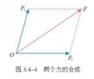

# 
高中物理学习笔记

##### 物理学：研究物质及其运动规律的科学 ——《序言》

---
[toc]

## 第一册

### 第一章 运动的描述

物体的空间位置随时间的变化，是自然界中最简单、最基本的运动形态，叫作**机械运动**。

#### 1. 质点 参考系

1. 在某些情况下，可以忽略物体的大小和开关，把它简化为一个具有质量的点，这样的点叫作**质点**。
2. 要描述一个物体的运动，首先要选定某个其他物体作为参考，观察物体的位置相对于这个“其他物体”是否随时间变化，以及怎样变化。这种用来作为参考的物体叫作**参考系**。

#### 2. 时间 位移

1. **时刻**与**时间**：时刻是一个时间点，如8点上课，8点45分下课，这是指这节课开始和结束的时刻，而这两个时刻之间的45分钟就是时间间隔。

2. **位移**：

- 直线运动的位移

$$\Delta x = x_2 - x_1$$

- 位移——时间图像

- 位移和时间的测量

#### 3. 位置变化快慢的描述——速度

1. 物理学中用位移与发生这段位移所用的时间之比表示物体运动的快慢，这就是**速度**（velocity）。

> 速度通常用字母 $v$ 表示，如果在时间 $\Delta t$ 内物体的位移是 $\Delta x$ ，它的速度就可以表示为 $$ v = \frac{\Delta x}{\Delta t} $$

在国际单位制中，速度的单位是**米每秒**，符号是$m/s$或$m\cdot s^{-1}$ 。

*速率是矢量，它既有大小，又有方向。速度的方向（物理运动的方向）和位移的方向相同。*

2. 平均速度和瞬时速度：

- 一般来说，物体在某一段时间内，运动的快慢通常是变化的。所以，由$\frac{\Delta x}{\Delta t}$ 求得的速度 $ v $ ，表示的只是物体在时间 $\Delta t$ 内运动的平均快慢程度，叫作**平均速度（average velocity）**。

- 当$\Delta t$ 足够小时，运动快慢的差异可以忽略不计，此时就把$\frac{\Delta x}{\Delta t}$叫作物体在$t$ 时刻的**瞬时速度(instantaneous velocity)**。

- 瞬时速度的大小通常叫作**速率（speed）**。

#### 4. 速度变化快慢的描述——加速度

1. 物理学中把速度的变化量与发生这一变化所用的时间之比，叫作**加速度（acceleration）**。通常用$a$表示。若用$\Delta v$表示速度在时间$\Delta t$内的变化量，则有$$a=\frac{\Delta v}{\Delta t}$$

在国际单位制中，加速度的单位是**米每二次方秒**，符号是$m/s^2$ 或$m\cdot s^{-2}$。

*加速度是矢量，它既有大小，也有方向。*

*加速度方向与速度变化量的方向相同。*

---

### 第二章 匀变速直线运动的研究

#### 1. 实验：探究小车速度随时间变化的规律
#### 2. 匀变速直线运动的速度与时间的关系

1. 沿着一条直线，且加速度不变的运动，叫作**匀加速直线运动**。

$$v=v_0+at$$

#### 3. 匀变速直线运动的位移与时间的关系

1. $$x=v_0t + \frac{1}{2}at^2$$

#### 4. 自由落体运动

1. 物体只在重力作用下从静止开始下落的运动，叫作**自由落体运动**。

2. 在同一地点，一切物体自由下落的加速度都相同，这个加速度叫作**自由落体加速度**，也叫**重力加速度**，通常用 $g$ 表示。重力加速度的方向是竖直向下。

---

### 第三章 相互作用——力

#### 1. 重力与弹力

1. 由于地球的吸引而使物体受到的力叫作**重力（gravity）**。

物体受到的重力 $G$ 与物体质量的关系是 $$G=mg$$

其中 $g$ 是自由落体的加速度（重力加速度）。

2. **弹力**

**胡克定律**：$F = kx$， $k$ 叫作弹簧的**劲度系数**。

#### 2. 摩擦力

1. 两个相互接触的物体，当它们相对滑动时，在接触面上会产生一种阻碍相对运动的力，这种力叫作**滑动摩擦力**。

**滑动摩擦力的大小跟压力的大小成正比**。$$F_f=\mu F_压$$

$\mu$ 是比例常数，叫作**动摩擦因数**。

2. 相互接触的两个物体之间只有相对运动的趋势，而没有相对运动，所以这时的摩擦力叫作**静摩擦力**。

#### 3. 牛顿第三定律

1. **两个物体之间的作用力和反作用力总是大小相等，方向相反，作用在同一条直线上。**

#### 4. 力的合成和分解

1. 实验表明，在两个力合成时，以表示这两个力的有向线段为邻边作平行四边形，这两个邻边之间的对角线就代表合力的大小和方向。这个规律叫**平行四边形定则**。

2. 既有大小又有方向，相加时遵守平行四边形定则的物理量叫作**矢量(vector)**。只有大小，没有方向，相加时遵守算术法则的物理量叫作**标量（scalar）**。

#### 5. 共点力的平衡

1. **在共点力作用下物体平衡的条件是合力为0**。
---

### 第四章 运动和力的关系

#### 1. 牛顿第一定律

1. **一切物体总保持匀速直线运动状态或静止状态，除非作用在它上面的力迫使它改变这种状态。**
物体这种保持原来匀速直线运动状态或静止状态的性质叫作**惯性**。牛顿第一定律也被叫作惯性定律。

物体维持其原有运动状态的“能力”不同，质量越大的物体惯性越大。描述物体惯性的物理量是它的**质量**。

*质量只有大小，没有方向，是标量。* 
在国际单位制中，质量的单位是千克，符号是$kg$。

#### 2. 实验：探究加速度与力、质量的关系
#### 3. 牛顿第二定律

1. **物体加速度的大小跟它受到的作用力成正比，跟它的质量成反比，加速度的方向跟作用力的方向相同。**

牛顿第二定律可表述为 $$a \varpropto \frac{F}{m}$$
也可以写成等式 $$F=kma$$
$k$ 是比例系数，当 $k=1$ 时，质量为 $1kg$ 的物体在某力的作用下获得 $1m/s^{2}$ 的加速度，则这个力 $$F = ma = 1kg \cdot m/s^{2}$$
力的单位是**千克米每二次方秒**。后人为了纪念牛顿，把它称作“牛顿”，用符号 $N$ 表示。在质量的单位取千克，加速度的单位取米每二次方秒，力的单位取牛顿时，牛顿第二定律可以表述为 $$F = ma$$

#### 4. 力学单位制

1. 在物理学中，只要选定几个物理量的单位，就能够利用物理量之间的关系推导出其他物理量的单位。这些被选定的物理量叫作**基本量**，它们相应的单位叫作**基本单位**。由基本量根据物理关系推导出来的其他物理量叫作**导出量**，推导出来的相应的单位叫作**导出单位**。

#### 5. 牛顿运动定律的应用
#### 6. 超重和失重

**课题研究**

**学生实验**

1. 任何测量结果都不可能绝对准确。测量值跟被测物理量的真实值之间总会有些差异，这种差异叫作**误差（error）**。

2. 由偶然因素造成的误差叫作**偶然误差**。由仪器结构缺陷，实验方法不完善造成的误差，叫作**系统误差**。

3. 物理学中把测量值与真实值之差，叫作**绝对误差**。物理学中把绝对误差与测量值之比，叫作**相对误差**。

4. 带有一位不可靠数字的近似数叫作**有效数字**。
---

## 第二册

### 第五章 抛体运动

#### 1. 曲线运动

1. 当 $B$ 点非常非常接近 $A$ 点时，这条割线就叫作曲线在 $A$ 点的**切线**。**质点在曲线上某一点的速度方向，沿曲线在这一点的切线方向。**

2. **当物体所受合力的方向与它的速度方向不在同一直线上时，物体做曲线运动。**

#### 2. 运动的合成与分解

遵守矢量运算法则，参考力的合成与分解。

#### 3. 实验：探究平抛运动的特点

1. 以一定的速度将物体抛出，在空气阻力可以忽略的情况下，物体只受重力的作用，这时的运动叫作**抛体运动**。如果初速度是沿水平方向的，这样的抛体运动叫作**平抛运动**。

#### 4. 抛体运动的规律

1. $x$ 方向，忽略空气阻力，速度不变 $v_x = v_0$。
2. $y$ 方向，只受重力， $v_y = gt$
---

### 第六章 圆周运动

#### 1. 圆周运动

1. 圆周运动中，弧长 $\Delta s$ 与时间 $\Delta t$ 之比反应了物体在 $A$ 点附近时运动的快慢，如果 $\Delta t$ 非常非常小，$\frac{\Delta s}{\Delta t}$ 就可以表示物体在 $A$ 点时运动的快慢，通常把它称为**线速度**。用符号 $v$ 表示，则有 $$v = \frac{\Delta s}{\Delta t}$$ 。

2. 如果物体沿着圆周运动，并且线速度的大小处处相等，这种运动叫作**匀速圆周运动**。

3. $$\omega = \frac{\Delta \theta}{\Delta t}$$

角的单位是**弧度**，符号是**rad**，所以角速度的单位是**弧度每秒**，符号是**rad/s**，通常把“弧度”或“rad”略去不写，所以角速度的单位可以写为 $s^{-1}$ 。

4. 做匀速圆周运动的物体，运动一周所用的时间叫作**周期**，用 $T$ 表示。周期也是常用的物理量，它的单位与时间的单位相同。转速是指物体转动的圈数与所用的时间之比，常用符号 $n$ 表示，转速的单位为**转每秒（r/s）**，或**转每分（r/min）**。 $r/s$ 和 $r/min$ 都不是国际单位制中的单位，运算时往往要把它们换算成弧度每秒。

5. 线速度与角速度的关系： $v=\omega r$ 。**在圆周运动中，线速度的大小等于角速度的大小与半径的乘积。**

#### 2. 向心力

做匀速圆周运动的物体所受的合力总指向圆心。这个指向圆心的力就叫做**向心力**。

1. 向心力的大小可以表示为 $$F_n=m\omega ^2 r$$ 或者 $$F_n=m\frac{v^2}{r}$$

#### 3. 向心加速度

1. 物体做匀速圆周运动时的加速度总指向圆心，我们把它叫作**向心加速度**。

2. 向心加速度的大小 $$a_n=\frac{v^2}{r}$$ 或 $$a_n=\omega ^2 r$$

#### 4. 生活中的圆周运动
---

### 第七章 万有引力与宇宙航行

#### 1. 行星的运动

**开普勒第一定律**：所有行星绕太阳运动的轨道都是椭圆，太阳处在椭圆的一个焦点上。

开普勒第一定律告诉我们：
1. 行星绕太阳运行的轨道严格来说不是圆而是椭圆；
2. 太阳不是在椭圆的中心，而是在其中的一个焦点上；
3. 行星与太阳间的距离是不断变化的。

**开普勒第二定律**：对任意一个行星来说，它与太阳的连线在相等的时间内扫过的面积相等。

开普勒第二定律告诉我们：
1. 当行星离太阳较近的时候，运行的速度较大，而离太阳较远的时候速度较小。

**开普勒第三定律**：所有行星轨道的半长轴的三次方根跟它的公转周期的二次方的比都相等。

若用 $a$ 代表椭圆轨道的半长轴， $T$ 代表公转周期，开普勒第三定律告诉我们： $$\frac{a^3}{T^2} = k$$

比值 $k$ 是一个对所有行星都相同的常量。

#### 2. 万有引力定律

1. **万有引力定律**：自然界中任何两个物体都相互吸引，引力的方向在它们的连线上，引力的大小与物体的质量 $m_1$ 和 $m_2$ 的乘积成正比、与它们的距离 $r$ 成反比，即 $$F=G\frac{m_1m_2}{r^2}$$

式中 $G$ 是比例系数，叫作**引力常量**，适用于任何两个物体。

2. 卡文迪许实验结果推算出万有引力常量。国际科技数据委员会2014年的推荐值 $G=6.67408(31) \times 10^{-11} N\cdot m^2 / kg ^2$ ，通常取 $G=6.67 \times 10^{-11} N\cdot m^2 / kg ^2$ 

#### 3. 万有引力理论的成就

1. 通过万有引力计算地球质量：由重力由引力产生得 $$mg=G\frac{mm_地}{R^2}$$

即 $$m_地=\frac{gR^2}{G}$$ 

$R$ 为地球半径。

2. 计算天体质量：行星做匀速圆周运动的向心力由万有引力提供。

$$G\frac{mm_太}{r^2} = m\omega ^2 r$$ ，由 $\omega = \frac{2\pi}{T}$ 得

$$G\frac{mm_太}{r^2}=m\frac{4\pi ^2 r}{T^2}$$ 得

$$m_太=\frac{4\pi ^2 r^3}{GT^2}$$

因此测出行星公转周期 $T$ 和它与太阳的距离 $r$ ，就可以算出太阳的质量。

同理要计算某个行星的质量，只要知道该行星的一个颗卫星绕其公转的周期与此卫星到此行星的距离即可。

#### 4. 宇宙航行

1. 根据万有引力提供物体运动所需的向心力，可得 $$G\frac{mm_地}{r^2}=m\frac{v^2}{r}$$

有 $v = \sqrt \frac{Gm_地}{r}$ 。已知地球半径，计算可得 $v=7.9km/s$ ，此即为**第一宇宙速度**。

物体在地面附近绕地球做匀速圆周运动时，可以近似认为向心力是由重力提供，有

$$mg = m\frac{v^2}{R}$$ 解得 $v=\sqrt{gR}$

2. 当速度大于等于 $11.2km/s$ 时，飞行器将摆脱地球引力，永远离开地球，此为**第二宇宙速度**。

3. 当速度大于等于 $16.7km/s$ 时，飞行器将摆脱太阳引力，飞离太阳系，此为**第三宇宙速度**。

第一宇宙速度又叫环绕速度，第二宇宙速度又叫作逃逸速度。逃逸速度是环绕速度的 $\sqrt 2$ 倍，即 $v^{'}=\sqrt{\frac{2Gm}{R}}$ ，这对其他天体也适用。由此也可知，天体的半径越小，质量越大，其逃逸速度也就越大，也就是说，其表面物体越不容易脱离它的束缚。

对于一个质量为 $m$ 的物体，当其半径 $R$ 不大于 $\frac{2Gm}{c^2}$ 时，即光都无法逃逸出去，即是一个黑洞。

#### 5. 相对论时空观与牛顿力学的局限性
---

### 第八章 机械能守恒定律

#### 1. 功与功率

$W=Flcos\theta$

1. **力对物体所做的功，等于力的大小、位移的大小、力与位移夹角的余弦这三者的乘积。**

功是标量，在国际单位制中，功的单位是**焦耳**，简称**焦**，符号是**J**。 $1J$ 等于 $1N$ 的力使物体在力的方向上发生 $1m$ 位移的过程中所做的功。所以 $$1J=1N\times 1m = 1N\cdot m$$

2. **当一个物体在几个力的共同作用下发生一段位移时，这几个力对物体所做的总功，是各个力分别对物体所做功的代数和。**

3. 在物理学中，做功的快慢用功率表示。如果从开始计时到时刻 $t$ 这段时间内，力做的功为 $W$ ，则功 $W$ 与完成这些功所用的时间 $t$ 之比叫作**功率（power）**。用 $P$ 表示功率则有 $$P=\frac{W}{t}$$。

在国际单位制中，功率的单位是**瓦特（watt）**，简称**瓦**，符号 **W** 。

#### 2. 重力势能

物体高度发生变化时，重力做功，势能发生变化。

$$W_G=mg\Delta h = mgh_1 - mgh_2$$

1. **物体运动时，重力对它做的功只跟它的起点和终点的位置有关，而跟物体运动的路径无关。**

2. 我们把 $mgh$ 叫作物体的 **重力势能**，常用 $E_p$ 表示，即 $$E_p = mgh$$ 与其他能一样，重力势能是标量。

3. 发生弹性形变的物体的各部分之间，由于有弹力的相互作用，也具有势能，这种势能叫作**弹性势能**。

#### 3. 动能和动能定理

1. 物体的动能：$$E_k=\frac{1}{2}mv^2$$

2. 动能定理：$$W=E_{k2}-E_{k1}$$

**力在一个过程中对物体做的功，等于物体在这个过程中动能的变化。**

#### 4. 机械能守恒定律

1. 重力势能、弹性势能与动能都是机械运动中的能量形式，统称为**机械能**。

2. **在只有重力或弹力做功的物体系统内，动能与势能可以互相转化，而总的机械能保持不变。** 这叫作 **机械能守恒定律**。

#### 5. 实验：验证机械能守恒定律

**课题研究**

---

## 第三册

### 第九章 静电场及其应用

#### 1. 电荷

1. 电荷的多少叫作**电荷量**，用 $Q$ 表示，有时也可以用 $q$ 来表示。在国际单位制中，它的单位是**库仑**，简称**库**，符号是 $C$ 。

> 1881年第1届国际电学大会确定库仑（ $C$ ）为电荷量的国际单位，定义为 $1A$ 恒定电流在 $1s$ 时间间隔内所传送的电荷量为 $1C$ 。

2. 金属中原子的外层电子往往会脱离原子核的束缚而在金属中自由运动，这种电子叫作**自由电子**。失去自由电子的原子便成为带<u>正电</u>的**离子**。

3. 当一个带电体靠近半导体时，由于电荷间相互吸引或排斥，导体中的自由电荷便会趋向或远离带电体，使导体靠近带电体的一端带异种电荷，远离带电体的一端带同种电荷。这种现象叫**静电感应**。

4. **电荷既不会创生，也不会消灭，它只能从一个物体转移到另一个物体，或者从物体的一部分转移到另一部分；在转移的过程中，电荷的总量保持不变。** 这个结论叫作**电荷守恒定律**。

5. 电荷守恒定律更普遍的表述是：**一个与外界没有电荷交换的系统，电荷的代数和保持不变**。

6. 迄今为止，实验发现的最小电荷量就是电子所带的电荷量。质子、正电子所带的电荷量与它相同，电性相反。人们把这个最小的电荷量叫作**元电荷**，用 $e$ 表示。实验还发现，所有带电体的电荷量都是 $e$ 的整数倍。这就是说，电荷量是不能连续变化的物理量。

7. 元电荷 $e$ 的数值，最早是由美国物理学家密产根测得。现在公认的元电荷 $e$ 的值为 $$e=1.602 176 634 \times 10^{-19}C$$ 

在计算中可取 $e=1.60\times 10^{-19}C$

8. 电子的电荷量与电子的质量 $m_e$ 之比，叫作电子的**比荷**。电子的质量 $m_e=9.11\times 10^{-31}kg$ ，所以电子的比荷为 $$\frac{e}{m_e}=1.76\times 10^{11}C/kg$$

#### 2. 库仑定律

1. **真空中两个静止点电荷之间的相互作用力，与它们的电荷量的乘积成正比，与它们的距离的二次方成反比，作用力的方向在它们的连线上。** 这个规律叫作**库仑定律**。这种电荷间的相互作用力叫作**静电力**或**库仑力**。

2. 当带电体的距离比它们的自身的大小大得多，以致带电体的形状、大小及电荷分布状况对它们之间的作用力的影响可以忽略时，这样的带电体可以看作带电的点，叫作**点电荷**。

$$F=k\frac{q_1q_2}{r^2}$$

$k$ 为比例系数，叫作**静电力常量**。

$$k=9.0\times 10^9N\cdot m^2/C^2$$

#### 3. 电场 电场强度

1. 19世纪30年代，英国科学家法拉第提出一种观点，认为在电荷的周围存在着由它产生的**电场**。

2. 静止电荷产生的电场，叫作**静电场**。

3. 电场强度 $E=\frac{F}{q}$ 。

4. 如果电场中各点的电场强度的大小相等、方向相同，这个电场就叫作**匀强电场**。

#### 4. 静电的防止与利用

1. 当导体内部各点的电场强度 $E=0$时，导体内的自由电子不再发生定向移动。这时我们说，导体达到**静电平衡**。
---

### 第十章 静电场中的能量

#### 1. 电势能和电势

$$W_{AB} = Fcos\theta |AB| = qEcos\theta |AB|=qE|AM|$$

1. 电荷在电场中也具有势能，我们称这种形式的能为**电势能**，用 $E_p$ 表示。

2. 电荷在电场中某一点的电势能与它的电荷量之比，叫作电场在这一点的**电势**。如果用 
$\varphi$ 表示电势，用 $E_p$ 表示电荷 $q$ 的电势能，则 $$\varphi=\frac{E_p}{q}$$

在国际单位制中，电势的单位是**伏特（volt）**，符号是 $V$ 。在电场中的某一点，如果电荷量为 $1C$ 的电荷在这点的电势能是 $1J$ 这一点的电势就是 $1V$ 。即 $$1V=1J/C$$

3. **沿着电场线方向电势逐渐降低。**

#### 2. 电势差

1. 在电场中，两点之间电势的差值叫作**电势差**，电势差也叫**电压**。
设电场中A点电势为 $\varphi A$ ，B点电势为 $\varphi B$ ，则它们之间的电势差可以表示为
$$U_{AB} = \varphi_A - \varphi_B$$ 也可以表示为
$$U_{BA} = \varphi_B - \varphi_A$$ 显然
$$U_{AB} = -U_{BA}$$

电荷 $q$ 在电场中从 $A$ 点移动到 $B$ 点时，静电力做的功 $W_{AB}$ 等于电荷在 $A$ 、 $B$ 两点的电势能之差。由此可以导出静电力做功与电势差的关系
$$W_{AB}=E_{pA}-E_{pB}$$
$$W_{AB}=q\varphi _A - q\varphi _B=q(\varphi _A - \varphi _B) = qU_{AB}$$ 即
$$U_{AB} = \frac{W_{AB}}{q}$$

2. 在电场中，电势相同的各点构成的面叫作**等势面**。

3. **电场线跟等势面垂直，并且由电势高的等势面指向电势低的等势面。**

#### 3. 电势差与电场强度的关系

$$W=Fd=qEd$$

$$U_{AB}=\frac{W_{AB}}{q}=Ed$$

1. **匀强电场中两点间的电势差等于电场强度与这两点沿电场方向的距离的乘积。**

2. 电场强度与电势差的关系也可以写作 $$E=\frac{U_{AB}}{d}$$ 它的意义是：在匀强电场中，电场强度的大小等于两点之间的电势差与两点沿电场强度方向的距离之比。也就是说，电场强度在数值上等于沿电场方向单位距离上降低的电势。

#### 4. 电容器与的电容

1. 电容器所带的电荷量 $Q$ 与电容器极板之间的电势差 $U$ 之比，叫作电容器的**电容**。用 $C$ 表示，则有 $$C=\frac{Q}{U}$$

在国际电位制中，电容的单位是**法拉**，简称**法**，符号是**F**。

实际常用的单位还有**微法（$\mu F$）** 和 **皮法（$pF$）** ，它们与法拉的关系是
$1\mu F = 10^{-6}F$
$1pF=10^{-12}F$

#### 5. 带电粒子在电场中的运动
---

### 第十一章 电路及其应用

#### 1. 电源和电流

1. 由稳定分布的电荷所产生的稳定电场，叫作**恒定电场**。

2. 大小、方向都不随时间变化的电流叫作**恒定电流**。

3. 单位时间内通过导体横截面的电荷量越多，电流就越大。如果用 $I$ 表示电流、 $q$ 表示在时间 $t$ 内通过导体横截面的电荷量，则有 $$I=\frac{q}{t}$$

在国际单位制中，电流的单位是**安培**，简称**安**，符号是**A**。

#### 2. 导体的电阻

1. 物理学中，把导体对电流的阻碍作用叫作导体的**电阻**。

2. **同种材料的导体，其电阻$R$与它的长度$l$成正比，与它的横截面积$S$成反比；导体的电阻还构成它的材料有关。** 写成公式则是 $$R=\rho \frac{l}{S}$$

$\rho$ 叫作这种材料的**电阻率**。

3. 1911年，科学家们发现一些金属在温度特别低时电阻可以降到0，这种现象叫作**超导现象**。

#### 3. 实验：导体电阻率的测量

#### 4. 串联电路和并联电路

1. **串联电路中的电流处处相等。**
2. **并联电路的总电流等于各支路电流之和。**
3. **串联电路两端的总电压等于各部分电路两端电压之和。**
4. **并联电路的总电压与各支路电压相等。**
5. **串联电路的总电阻等于各部分电路电阻之和。**
6. **并联电路总电阻的倒数等于各支路电阻的倒数之和。**

#### 5. 实验：练习使用多用电表
---

### 第十二章 电能 能量守恒定律

#### 1. 电路中的能量转化

$$W=Uq=UIt$$

1. 电流在一段电路中所做的功与通电时间之比叫作**电功率**，用$P$表示，由$P=\frac{W}{t}$ ，进而得到 $$P=UI$$ 

这个公式表示，**电流在一段电路中做功的功率$P$等于这段电路两端的电压$U$与电流$I$的乘积。**

2. **焦耳定律：电流通过导体产生的热量跟电流的二次方成正比，跟导体的电阻及通电时间成正比。**

$$Q=I^2Rt$$

#### 2. 闭合电路的欧姆定律

1. 在电源内部，存在着由正极指向负极的电场。在这个电场中，静电力阻碍正电荷向正极移动。因此，在电源内部要使正电荷向正极移动，就一定要有一种与静电力方向相反的力作用于电荷才行。我们把这种力叫作**非静电力**。

2. **电源是通过非静电力做功把其他形式的能转化为电势能的装置。**

3. 在物理学中，我们用非静电力所做的功与所移动的电荷量之比来表示电源的这种特性，叫作**电动势**。

$$E=\frac{W}{q}$$

4. **欧姆定律：导体中的电流$I$跟导体两端的电压$U$成正比，跟导体的电阻$R$成反比。** $$I=\frac{U}{R}$$

#### 3. 实验：电池电动势和内阻的测量
#### 4. 能源与可持续发展

1. **能量守恒定律：能量既不会凭空产生，也不会凭空消失，它只能从一种形式转化为其他形式，或者从一个物体转移到别的物体，在转化或转移的过程中，能量总保持不变。**
---

### 第十三章 电磁感应与电磁波初步

#### 1. 磁场 磁感线

1. **安培定则（右手螺旋定则）：** 用右手握住导线，让伸直的拇指所指的方向与电流方向一致，弯曲的四指所指的方向就是磁感线环绕的方向。

#### 2. 磁感应强度 磁通量

1. 把很短一段通电导线中的电流 $I$ 与导线长度 $l$ 的乘积 $Il$ 叫作**电流元**。

2. **磁感应强度**表征磁强弱。

$$B=\frac{F}{Il}$$

在国际单位制中，磁感应强度的单位是**特斯拉**，简称**特**，符号是**T**。磁感应强度是矢量，它的方向就是该处小磁针静止时N极所指的方向。

3. 如果磁场中各点的磁感应强度的大小相等、方向相同，这个磁场叫作**匀强磁场**。

4. 设在磁感应强度为$B$的匀强磁场中，有一个与磁场方向垂直的平面，面积为$S$，我们把$B$与$S$的乘积叫作穿过这个面积的**磁通量**，简称**磁通**。用字母$\phi$表示磁通量，则 $$\phi=BS$$

在国际单位制中，磁通量的单位是**韦伯**，简称**韦**，符号是**Wb**。

#### 3. 电磁感应现象及应用

1. **当穿过闭合导体回路的磁通量发生变化时，闭合导体回路中就产生感应电流。**

#### 4. 电磁波的发现及应用

1. **变化的磁场产生电场。**
2. **变化的电场产生磁场。**
3. 电磁波的波速$c$与波长$\lambda$、频率$f$的关系是 $$c=\lambda f$$

#### 5. 能量量子化

1. 1900年底，普朗克作出了这样大胆假设：振动着的带电粒子的能量只能是某一最小能量值$\varepsilon$ 的整数倍。这个不可再分的最小能量值 $\varepsilon$ 叫作**能量子**，它的大小为 $$\varepsilon=hv$$

$v$ 是电磁波的频率，$h$ 是一个常量，后人称之为**普朗克常量**，其值为 
$$h=6.626 070 15\times 10^{-34}J\cdot s$$

2. 量子化的能量值叫作**能级**。

**课题研究**

---

## 选择性必修第一册

### 第一章 动量守恒定律

#### 1. 动量

1. 物理学中把**质量和速度的乘积 $mv$ 定义为物体的动量**，用字母 $p$表示 $$p=mv$$

动量的单位是由质量与速度的单位构成的，是**千克每秒**，符号是 $kg\cdot m/s$。动量是矢量，方向与速度的方向相同。

#### 2. 动量定理

1. 物理学中把**力与力的作用时间的乘积叫作力的冲量**，用字母 $I$ 表示冲量，则 $$I=F\Delta t$$

冲量的单位是**牛秒**，符号是 $F\cdot S$ 。

2. **物体在一个过程中所受力的问题等于它在这个过程始末的动量变化量。** 这个关系叫作**动量定理**。

#### 3. 动量守恒定律

1. 我们把由两个（或多个）相互作用的物体构成的整体叫作一个力学系统，简称**系统**。系统中物体间的作用力，叫作**内力**。系统以外的物体施加给系统内物体的力，叫作**外力**。

2. **如果一个系统不受外力，或者所受外力的矢量和为0，这个系统的总动量保持不变。**，这就是**动量守恒定律**。

#### 4. 实验：验证动量守恒定律
#### 5. 弹性碰撞和非弹性碰撞

1. 如果系统在碰撞前后动能不变，这类碰撞叫作**弹性碰撞**。如果系统碰撞后动能减少，这类碰撞叫作**非弹性碰撞**。

#### 6. 反冲现象 火箭

---

### 第二章 机械振动

#### 1. 简谐运动

1. 我们把物体或物体的一部分在一个位置附近的往复运动称为**机械运动**，简称**振动**。

2. 我们把小球和弹簧组成的系统称为**弹簧振子**。弹簧未形变时，小球所受全力为0，处于**平衡位置**。

3. **如果物体的位移与时间的关系遵从正弦函数的规律，即它的振动图像（$x-t$图像）是一条正弦曲线，这样的振动是一种简谐运动。**

#### 2. 简谐运动的描述

做简谐运动的物体的位移与运动时间之间满足正弦函数关系，因此，位移的一般函数表达式为
$$x=Asin(\omega t + \varphi)$$

1. 振动物体离开平衡位置的最大距离，叫作振动的**振幅**。常用字母 $A$ 表示。

2. 做简谐运动的物体完成一次全振动所需要的时间，叫作振动的**周期**，周期的倒数叫作振动的**频率**。$$f=\frac{1}{T}$$

在国际单位制中，周期的单位是秒。频率的单位是**赫兹**，简称**赫**，符号是**Hz**。

#### 3. 简谐运动的回复力和能量

1. 使物体在平衡位置做往复运动的力称为**回复力**。$$F=-kx$$

2. **如果物体在运动方向上所受的力与它偏离平衡位置的大小成正比，并且总是指向平衡位置，质点的运动就是简谐运动。**

#### 4. 单摆

1. 实验表明：单摆做简谐运动的周期与摆长有关，摆长越长，周期越大；单摆的周期与摆球质量和振幅无关。$$T=2\pi \sqrt{\frac{l}{g}}$$

#### 5. 实验：用单摆测量重力加速度
#### 6. 受迫振动 共振

1. 弹簧振子与单摆在没有外力干预的情况下做简谐运动，周期或频率与振幅无关，仅由系统自射的性质决定，我们把这种振动称为固有振动，其振动频率称为**固有频率**。

2. 振幅随时间逐渐减小的振动称为**阻尼振动**。

3. 系统在驱动力作用下的振动叫作**受迫振动**。

4. 当驱动力的频率等于固有频率时，物体做受迫振动的振幅达到最大值，这种现象叫**共振**。

### 第三章 机械波

#### 1. 波的形成

1. 振动的传播称为**波动**，简称**波**。

2. 质点的振动方向与波的传播方向相互垂直的波，叫作**横波**。在横波中，凸起的最高处叫作**波峰**，凹下的最低处叫作**波谷**。

3. 质点的振动方向与波的传播方向在同一直线上的波，叫作**纵波**。

4. 波借以传播的物质，叫作**介质**。机械振动在介质中传播，形成了**机械波**。

#### 2. 波的描述

1. 如果波的图像是正弦曲线，这样的波叫作正弦波，也叫**简谐波**。

2. 振动相伴总是相同的两个相邻质点间的距离，叫作**波长**，通常用 $\lambda$ 表示。

3. 机械波在介质中传播的速度为 $$v=\frac{\lambda}{T}$$ 
而 $f=\frac{1}{T}$ ，所以也可以写成 $$v=f\lambda$$

#### 3. 波的反射、折射和衍射

1. 波可以绕过障碍物继续传播，这种现象叫作波的**衍射**。

#### 4. 波的干涉

1. 频率相同、相位差恒定、振动方向相同的两列波叠加时，某些区域的振动总是加强，某些区域的振动总是减弱，这种现象叫作波的**干涉**。

#### 5. 多普勒效应

1. 波源与观察者相互靠近或者相互远离时，接收到的波的频率都会发生变化。人们把这种现象叫作**多普勒效应**。

### 第四章 光

#### 1. 光的折射

1. **折射定律：折射光线与入射光线、法线处在同一平面内，折射光线与入射光线分别位于法线的两侧；入射角的正弦与折射角的正弦成正比。**

$$\frac{sin\theta _1}{sin\theta _2}=n_{12}$$

式中 $n_{12}$ 是比例常数，它与入射角、折射角的大小无关，只与两种介质的性质有关。

2. 光从真空射入某种介质发生折射时，入射角的正弦与折射角的正弦之比，叫作这种介质的绝对折射率，简称**折射率**。用符号 $n$ 表示。真空的折射率为 1，空气的折射率近似为 1。

3. 研究表明，光在不同介质中传播的速度不同；某种介质的折射率，等于光在真空中的传播速度 $c$ 与光在这种介质中的传播速度 $v$ 之比，即 $$n=\frac{c}{v}$$

#### 2. 全反射

1. 对于折射率不同的两种介质，我们把折射率较小的称为**光疏介质**，折射率较大的称为**光密介质**。

2. 当入射角增大到某一角度，使折射角达到 $90^{\circ}$ 时，折射光完全消失，只剩下反射光，这种现象叫作**全反射**，这时的入射角叫作**临界角**。

#### 3. 光的干涉
#### 4. 实验：用双缝干涉测量光的波长
#### 5. 光的衍射
#### 6. 光的偏振 激光

1. 在垂直于传播方向的平面上，沿着某个特定方向振动的光叫作**偏振光**。

---

## 选择性必修第二册

### 第一章 安培力与洛伦兹力

#### 1. 磁场对通电导线的作用力

1. 人们把通电导线在磁场中受的力称为**安培力**，把电流的单位定为安培。

2. **伸开左手，使拇指与其余四个手指垂直，并且都与手掌在同一个平面内；让磁感线从掌心垂直进入，并使四指指向电流的方向，这时拇指所指的方向就是通电导线在磁场中所受安培力的方向。** 这就是判定通电导线在磁场中受力方向的**左手定则**。

$$F=IlB$$

。

#### 2. 磁场对运动电荷的作用力

1. 运动电荷在磁场中受到的安培力称为**洛伦兹力**。

2. 洛伦兹力的方向可以依照**左手定则**判定：**伸开左手，使拇指与其余四指垂直，并且都与手掌在同一个平面内；让磁感线从掌心垂直进入，并使四指指向正电荷运动的方向，这时拇指所指的方向就是运动的正电荷在磁场中所受洛伦兹力的方向。**

$$F=qvB$$

#### 3. 带电粒子在匀强磁场中的运动

1. 洛伦兹力总是与粒子的运动方向垂直，只改变粒子速度的方向，不改变粒子速度的大小。

2. 沿着与磁场垂直的方向射入磁场的带电粒子，在匀强磁场中做匀速圆周运动。

3. 假设电荷量为 $q$ 的粒子，在磁感应强度为 $B$ 的匀强磁场中以速度 $v$ 运动，洛伦兹力提供向心力
$$F=qvB=m\frac{v^2}{r}$$

可得圆周运动的半径 $$r=\frac{mv}{qB}$$ 。由匀速圆周运动的周期 
$$T=\frac{2\pi r}{v}$$
可得
$$T=\frac{2\pi m}{qB}$$

#### 4. 质谱仪与回旋加速器

1. 由带电粒子在匀强磁场中做圆周运动半径公式可知，如果 $B$、$v$ 相同，$m$ 不同，则 $r$ 不同。这样就可以把不同粒子分开。

### 第二章 电磁感应

#### 1. 楞次定律

1. **楞次定律：感应电流具有这样的方向，即感应电流的磁场总要阻碍引起感应电流的磁通量的变化。**

2. **伸开右手，使拇指与其余四个手指垂直，并且都与手掌在同一个平面内；让磁感线从掌心进入，并使拇指指向导线运动的方向，这时四指所指的方向就是感应电流的方向。** 这就是更便于判定导线切割磁感线时感应电流方向的**右手定则**。

#### 2. 法拉第电磁感应定律

1. 在电磁感应现象中产生的电动势叫作**感应电动势**。

2. **法拉第电磁感应定律：闭合电路中感应电动势的大小，跟穿过这一电路的磁通量的变化率成正比。**

$$E=\frac{\Delta \phi}{\Delta t} = Blv$$

#### 3. 涡流、电磁阻尼和电磁驱动

#### 4. 互感和自感

1. 两个没有导线相连的线圈，当一个线圈中的电流变化时，它所产生的变化的磁场会在另一个线圈中产生感应电动势。这种现象叫**互感**。

2. 当一个线圈中的电流发生变化时，它所产生的变化的磁场在线圈本身激发出感应电动势。这种现象称为**自感**。

电感的单位是**亨利**，简称**亨**，符号是**H**。

### 第三章 交变电流

#### 1. 交变电流

1. 电流、电压大小和方向随时间做周期性变化，这样的电流叫作**交变电流**，简称**交流**。方向不随时间变化的电流称为**直流**。

#### 2. 交变电流的描述

1. 让交变电流与恒定电流分别通过大小相同的电阻，如果在交变电流的一个周期内它们产生的热量相等，而这个恒定电流的电流与电压分别为 $I$ 、 $U$ ，我们就把 $I$ 、 $U$ 叫作这一交变电流的**有效值**。

正弦式交变电流的有效值与峰值之间有如下关系
$$I=\frac{I_m}{\sqrt 2} = 0.707 I_m$$
$$U=\frac{U_m}{\sqrt 2} = 0.707 U_m$$

#### 3. 变压器

1. **变压器**是由闭合铁芯和绕在铁芯上的两个线圈组成的。一个线圈与交流电源连接，叫作**原线圈**，也叫初级线圈；另一个线圈与负载连接，叫作**副线圈**，也叫次线线圈。

$$\frac{U_1}{U_2}=\frac{n_1}{n_2}$$

#### 4. 电能的输送

减少电能在传输线上的损耗 $P=I^2r = UI$ ，在总功率一定的情况下，通过增大电压，减小电流，从而减小传输线上的电能消耗。

### 第四章 电磁振荡与电磁波

#### 1. 电磁振荡

1. 电路的电压发生周期性的变化，电路中的电流也发生周期性的变化。像这样大小和方向都做周期性迅速变化的电流，叫作**振荡电流**，产生振荡电流的电路叫作**振荡电路**。

2. $LC$ 电路的周期 $T$ 与电感 $L$ 、电容 $C$ 的关系是
$$T=2\pi \sqrt{LC}$$ 

#### 2. 电磁场与电磁波

1. **变化的磁场产生电场。**

2. **变化的电场产生磁场。**

3. 变化的电场和磁场总是相互联系的，形成一个不可分割的统一的**电磁场**。

#### 3. 无线电波的发射和接收

1. 在电磁波发射技术中，使载波随各种信号而改变的技术叫作**调制**。

#### 4. 电磁波谱

### 第五章 传感器

#### 1. 认识传感器

1. 能够将力、温度、光、声、化学成分等被测量，并能把它们按照一定的规律转换为便于传送和处理的可用信号输出的器件或装置，叫作**传感器**。

#### 2. 常见传感器的工作原理及应用
#### 3. 利用传感器制作简单的自动控制装置

---

## 选择性必修第三册

### 第一章 分子动理论

#### 1. 分子动理论的基本内容
#### 2. 实验：油膜法估测油酸分子的大小
#### 3. 分子运动速率分布规律
#### 4. 分子动能和分子势能

### 第二章 气体、固体和液体

#### 1. 温度和温标
#### 2. 气体的等温变化
#### 3. 气体的等压变化和等容变化
#### 4. 固体
#### 5. 液体

### 第三章 热力学定律

#### 1. 功、热和内能的改变
#### 2. 热力学第一定律
#### 3. 能量守恒定律
#### 4. 热力学第二定律

### 第四章 原子结构和波粒二象性

#### 1. 普朗克黑体辐射理论
#### 2. 光电效应
#### 3. 原子的核式结构模型
#### 4. 氢原子光谱和玻尔的原子模型
#### 5. 粒子的波动性和量子力学的建立

### 第五章 原子核

#### 1. 原子核的组成
#### 2. 放射性元素的衰变
#### 3. 核力与结合能
#### 4. 核裂变与核聚变
#### 5. “基本”粒子